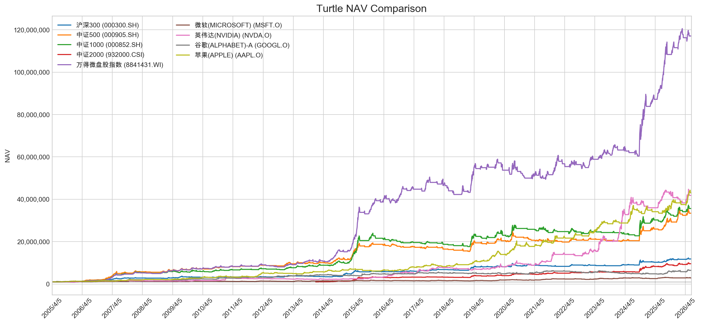

# 海龟交易法则回测 / Turtle Trading Backtest

[中文](#中文版) | [English](#english-version)

<a id="中文版"></a>

## 中文版

这是一个以原始 OHLC 行情为唯一数据输入的 Python 海龟回测项目。

TR、ATR、唐奇安通道、突破/退出、成交价、止损、风险仓位、交易成本、现金、NAV 和绩效指标的计算顺序，来自此前经过 Excel 回测验证的逻辑；但 Python 策略引擎不读取 Excel 公式、缓存结果、单元格地址或工作表行号。

换句话说：

> 保留经 Excel 验证的交易规则，移除 Excel 工作表布局对策略的控制。

### NAV 总览

下图比较原始数据中全部 9 个标的使用同一套海龟规则后的实际 NAV：



## 项目结构

```text
turtle-trading-backtest/
├── data/
│   ├── market_data.xlsx         # 5个指数和4只美股的 Raw Data
│   └── README.md                # 数据说明
├── charts/
│   └── turtle_nav_comparison.png
├── outputs/                     # 本地生成结果，默认不提交
├── turtle_backtest.py           # 海龟策略、账户和绩效计算
├── run_backtest.py              # 命令行入口
├── inspect_workbook.py          # Raw Data xlsx 的只读 XML 工具
├── index_nav_vs_close.ipynb     # 回测图表 Notebook
├── test_strategy.py             # 策略规则和无未来数据测试
├── test_multisymbol.py          # 9标的回归测试
├── requirements-notebook.txt    # Notebook 依赖
└── README.md
```

回测核心仅依赖 Python 标准库。运行 Notebook 需要：

```bash
python3 -m pip install -r requirements-notebook.txt
```

## 数据输入

项目支持两种输入。

### 1. Raw Data xlsx

仓库自带：

```text
data/market_data.xlsx
```

程序在工作表中横向识别连续五列：

```text
Date | open | high | low | close
```

每个五列块代表一个标的。当前文件包含：

| 代码 | 名称 | 类型 |
|---|---|---|
| `000300.SH` | 沪深300 | 指数 |
| `8841431.WI` | 万得微盘股指数 | 指数 |
| `000905.SH` | 中证500 | 指数 |
| `000852.SH` | 中证1000 | 指数 |
| `932000.CSI` | 中证2000 | 指数 |
| `MSFT.O` | 微软 | 股票 |
| `NVDA.O` | 英伟达 | 股票 |
| `GOOGL.O` | 谷歌-A | 股票 |
| `AAPL.O` | 苹果 | 股票 |

对于上市较晚的标的，从第一条完整且为正数的 OHLC 开始建立自己的时间序列。

### 2. CSV

CSV 必须包含：

```text
Date,open,high,low,close
```

表头大小写不敏感。日期支持 ISO 日期或电子表格日期序列值。

## 快速开始

所有命令均在仓库根目录执行。

### 查看标的

```bash
python3 run_backtest.py data/market_data.xlsx --list-symbols
```

### 回测单个标的

```bash
python3 run_backtest.py \
  data/market_data.xlsx \
  --symbol 000905.SH \
  -o outputs/csi500.csv
```

如果不指定 `--symbol`，Raw Data xlsx 默认选择 `000300.SH`。

### 回测全部标的

```bash
python3 run_backtest.py \
  data/market_data.xlsx \
  --all \
  -o outputs
```

批量模式生成：

```text
outputs/
├── 000300.SH_沪深300.csv
├── 000905.SH_中证500.csv
├── ...
├── AAPL.O_苹果(APPLE).csv
└── summary.csv
```

### 回测 CSV

```bash
python3 run_backtest.py \
  path/to/prices.csv \
  -o outputs/backtest_result.csv
```

## 默认参数

| 参数 | 命令行参数 | 默认值 |
|---|---|---:|
| ATR 周期 | `--atr-period` | 20 |
| 入场通道 | `--entry-period` | 20 |
| 退出通道 | `--exit-period` | 10 |
| 预热行情数 | `--warmup-bars` | 自动 |
| 风险比例 | `--risk` | 2% |
| 买入成本率 | `--buy-cost` | 0.02% |
| 卖出成本率 | `--sell-cost` | 0.07% |
| 初始资金 | `--initial-cash` | 1,000,000 |
| 最小交易单位 | 代码参数 | 100 |

完整帮助：

```bash
python3 run_backtest.py --help
```

## 价格清洗

每个 OHLC 值先转换为数字：

- 大于 0：保留；
- 空值、非数字或小于等于 0：视为缺失；
- 非首日缺失值：使用前一日相同字段的清洗值向前填充。

策略公式使用 `Clean Open/High/Low/Close`，原始 OHLC 同时保留在输出中。

## 策略公式

所有核心公式位于：

```text
turtle_backtest.py → run_backtest()
```

### 1. TR

首条行情：

```text
TR = High - Low
```

之后：

```text
TR(t) = MAX(
    High(t) - Low(t),
    ABS(High(t) - Close(t-1)),
    ABS(Close(t-1) - Low(t))
)
```

### 2. ATR

首日以 TR 初始化，之后采用与原回测一致的指数平滑：

```text
ATR(t) =
2 / (N + 1) × TR(t)
+ (N - 1) / (N + 1) × ATR(t-1)
```

默认 `N=20`。

### 3. 参数驱动的预热

默认预热期不再引用 Excel 行号，而是：

```text
Required History =
MAX(ATR Period, Entry Period, Exit Period)
```

默认参数下：

```text
MAX(20, 20, 10) = 20
```

因此先完成20条历史行情，从第21条行情开始计算信号。

如需复现旧回测表“先预热51条行情”的实验口径，可以显式指定：

```bash
--warmup-bars 51
```

这是兼容参数，不是 Excel 行号。

### 4. 唐奇安通道

```text
Past High(t) = t之前20个交易日 Clean High 的最大值
Past Low(t)  = t之前10个交易日 Clean Low 的最小值
```

当前行情不进入自己的通道，避免未来数据。

### 5. 入场与退出

空仓时：

```text
High(t) > Past High(t) → 买入
```

持仓时：

```text
Exit Level(t) = MAX(Past Low(t), Stop Loss(t-1))
Low(t) < Exit Level(t) → 全部卖出
```

使用严格不等式：刚好等于通道价格不会触发交易。

### 6. 成交价格

```text
Buy Price = MAX(Open(t), Past High(t))

Exit Level = MAX(Past Low(t), Stop Loss(t-1))
Sell Price = MIN(Open(t), Exit Level)
```

这会反映突破和退出时的开盘跳空。

### 7. 止损

```text
Stop Loss = Buy Price - ATR(t-1)
```

止损在建仓时确定，持仓期间固定，平仓后清空。

### 8. 仓位

```text
Risk-limited Shares =
NAV(t-1) × Risk Fraction / ATR(t-1)

Cash-limited Shares =
Cash(t-1) / [Buy Price × (1 + Buy Cost Rate)]

Position =
MIN(Risk-limited Shares, Cash-limited Shares)
向下取整到100股
```

### 9. 现金和 NAV

```text
Position Change = Position(t) - Position(t-1)

Cash(t) =
Cash(t-1)
- Position Change × Trade Price
- ABS(Position Change) × Trade Price × Cost Rate

Stock Value(t) = Position(t) × Clean Close(t)
NAV(t) = Cash(t) + Stock Value(t)
```

## 策略边界

当前版本严格保留原回测中实际使用的规则：

- 只做多；
- 一次性建仓和全部平仓；
- 没有 `0.5N` 加仓；
- 没有四 Unit 上限；
- 没有 System 1 / System 2；
- 没有组合相关性控制；
- 使用固定 1 ATR 止损。

准确描述是：

> 前20日高点突破入场，前10日低点或固定1 ATR止损退出，按NAV的2%风险预算确定仓位。

## 输出

逐日 CSV 包含：

| 分类 | 字段 |
|---|---|
| 原始价格 | `Date`, `open`, `high`, `low`, `close` |
| 清洗价格 | `Clean Open`, `Clean High`, `Clean Low`, `Clean Close` |
| 波动和通道 | `TR`, `ATR`, `Past High`, `Past Low` |
| 交易 | `Signal`, `Trade Price`, `Stop Loss`, `Trade` |
| 账户 | `Position`, `Cash`, `Stock Value`, `Trading Cost` |
| 绩效 | `Daily P&L`, `NAV`, `Daily Return`, `Drawdown` |
| 对比序列 | `NAV Index`, `Close Index` |

```text
NAV Index = NAV / Initial Cash × 100
Close Index = Clean Close / First Clean Close × 100
```

## 绩效指标

复合年化收益率：

```text
CAGR =
(Ending NAV / Starting NAV) ^ (365 / Calendar Days) - 1
```

年化波动率：

```text
Daily Return Sample StdDev × SQRT(252)
```

夏普比率：

```text
Mean Daily Return × 252 / Annualized Volatility
```

当前夏普比率假设无风险利率为 0。

## Notebook

打开：

```text
index_nav_vs_close.ipynb
```

Notebook 直接调用 `turtle_backtest.py`，默认读取 `data/market_data.xlsx`，并绘制：

- 每个标的的实际 NAV（左轴）与 Close（右轴）；
- 9个标的的实际 NAV 总览；
- 绩效汇总表。

横轴主刻度固定为每年4月5日。

双轴图只能比较走势和拐点。要严格比较收益，应使用同样从100开始的 `NAV Index` 和 `Close Index`。

## 测试

```bash
python3 -m unittest -v test_strategy test_multisymbol
```

测试覆盖：

- 预热期由参数自动决定；
- 通道只使用已完成的历史行情；
- 严格突破规则；
- 添加未来行情不会改变历史结果；
- 自定义预热期参数验证；
- 51条兼容预热复现旧回测结果；
- 9个标的全部完成且账户平衡；
- 默认回测结果回归检查。

---

<a id="english-version"></a>

## English version

This is a Python Turtle Trading backtest driven exclusively by raw OHLC market data.

The calculation order for TR, ATR, Donchian channels, entry/exit decisions, execution prices, stops, risk sizing, costs, cash, NAV, and performance metrics comes from the previously validated Excel model. The Python engine does not read spreadsheet formulas, cached results, cell addresses, or worksheet row numbers.

In short:

> Keep the trading rules validated in Excel; remove spreadsheet layout from strategy control.

### NAV overview


## Structure

```text
turtle-trading-backtest/
├── data/market_data.xlsx
├── charts/turtle_nav_comparison.png
├── outputs/
├── turtle_backtest.py
├── run_backtest.py
├── inspect_workbook.py
├── index_nav_vs_close.ipynb
├── test_strategy.py
├── test_multisymbol.py
├── requirements-notebook.txt
└── README.md
```

The core engine uses only the Python standard library. For the notebook:

```bash
python3 -m pip install -r requirements-notebook.txt
```

## Inputs

Supported inputs:

1. a Raw Data xlsx containing repeated `Date | open | high | low | close` blocks;
2. a CSV containing `Date,open,high,low,close`.

The bundled `data/market_data.xlsx` contains five indices and four US stocks. Strategy calculations use raw OHLC values only—not workbook formulas or calculated cells.

## Quick start

```bash
# List instruments
python3 run_backtest.py data/market_data.xlsx --list-symbols

# Backtest one instrument
python3 run_backtest.py \
  data/market_data.xlsx \
  --symbol 000905.SH \
  -o outputs/csi500.csv

# Backtest all instruments
python3 run_backtest.py \
  data/market_data.xlsx \
  --all \
  -o outputs
```

## Default parameters

| Parameter | CLI option | Default |
|---|---|---:|
| ATR period | `--atr-period` | 20 |
| Entry period | `--entry-period` | 20 |
| Exit period | `--exit-period` | 10 |
| Warm-up bars | `--warmup-bars` | Automatic |
| Risk fraction | `--risk` | 2% |
| Buy cost | `--buy-cost` | 0.02% |
| Sell cost | `--sell-cost` | 0.07% |
| Initial cash | `--initial-cash` | 1,000,000 |
| Lot size | Code parameter | 100 |

## Python-native warm-up

By default:

```text
Required History =
MAX(ATR Period, Entry Period, Exit Period)
```

With the default parameters, signals begin after 20 completed historical bars.

To reproduce the legacy experiment with 51 completed warm-up bars:

```bash
--warmup-bars 51
```

This is an explicit compatibility parameter, not a worksheet row number.

## Strategy formulas

### True Range

```text
TR(t) = MAX(
    High(t) - Low(t),
    ABS(High(t) - Close(t-1)),
    ABS(Close(t-1) - Low(t))
)
```

The first TR is `High - Low`.

### ATR

```text
ATR(t) =
2 / (N + 1) × TR(t)
+ (N - 1) / (N + 1) × ATR(t-1)
```

### Channels

```text
Past High(t) = highest Clean High over the 20 bars before t
Past Low(t)  = lowest Clean Low over the 10 bars before t
```

The current bar is excluded.

### Entry and exit

```text
High(t) > Past High(t) → Buy

Exit Level(t) = MAX(Past Low(t), Stop Loss(t-1))
Low(t) < Exit Level(t) → Sell all
```

Both are strict inequalities.

### Execution

```text
Buy Price = MAX(Open(t), Past High(t))
Sell Price = MIN(Open(t), Exit Level(t))
```

### Stop

```text
Stop Loss = Buy Price - ATR(t-1)
```

The stop remains fixed while the position is open.

### Position sizing

```text
Risk-limited Shares =
NAV(t-1) × Risk Fraction / ATR(t-1)

Cash-limited Shares =
Cash(t-1) / [Buy Price × (1 + Buy Cost Rate)]

Position =
MIN(Risk-limited Shares, Cash-limited Shares)
rounded down to the nearest 100 shares
```

### Account

```text
Cash(t) =
Cash(t-1)
- Position Change × Trade Price
- ABS(Position Change) × Trade Price × Cost Rate

Stock Value(t) = Position(t) × Clean Close(t)
NAV(t) = Cash(t) + Stock Value(t)
```

## Strategy scope

The implemented strategy is long-only, enters once, exits the full position, uses a fixed 1-ATR stop, and does not implement pyramiding, shorting, dual systems, or portfolio correlation limits.

## Metrics

```text
CAGR =
(Ending NAV / Starting NAV) ^ (365 / Calendar Days) - 1

Annualized Volatility =
Daily Return Sample StdDev × SQRT(252)

Sharpe Ratio =
Mean Daily Return × 252 / Annualized Volatility
```

The Sharpe ratio assumes a zero risk-free rate.

## Notebook

`index_nav_vs_close.ipynb` calls the same strategy engine and reads `data/market_data.xlsx`. It contains dual-axis NAV/Close charts, a nine-instrument NAV comparison, and a performance table.

Dual-axis line heights are not directly comparable. Use `NAV Index` and `Close Index`, both normalized to 100, for return comparisons.

## Tests

```bash
python3 -m unittest -v test_strategy test_multisymbol
```

Tests cover parameter-driven warm-up, completed-bar-only channels, strict breakouts, future-data invariance, legacy 51-bar compatibility, all nine instruments, account balance checks, and regression results.
